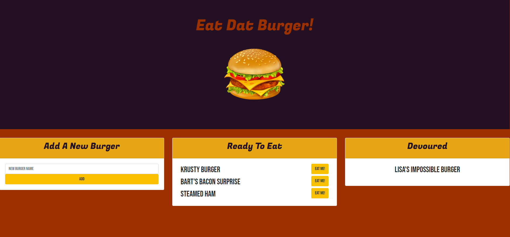

# Eat_Da_Burger
[Link to Heroku Deployment](https://tranquil-sea-25132.herokuapp.com/)

## Description
This application is a simple full stack development CRUD application. The app allows the user to enter any burger name to add it to the menu, and the MySQL database. The user can then click the "EAT ME!" button and turn the "Devoured" status to "true", moving it to the "Devoured" menu. 

## Tech Stack
-HTML
-CSS
-Bootstrap 4
-Handlebars
-Node.js
-NPM
-MySQL

## License

This application is covered under the MIT license.

## Credits

This project was prompted by a homework assignment through Trilogy Education Services.

## Questions

If you have further questions, please email me at nckoller@gmail.com.

